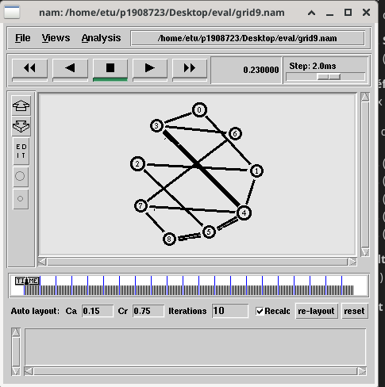
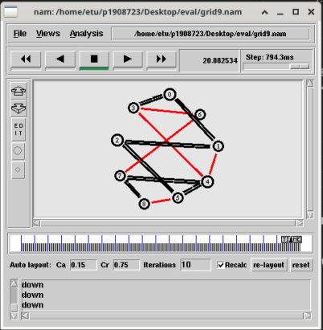
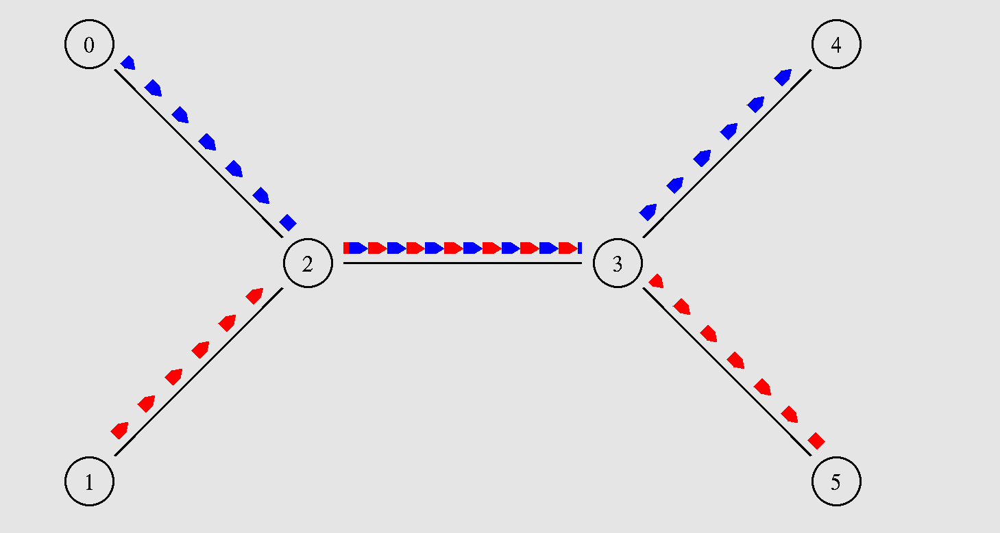
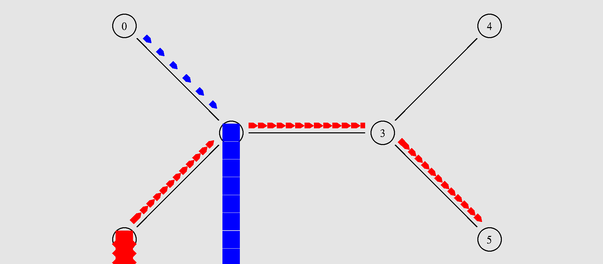
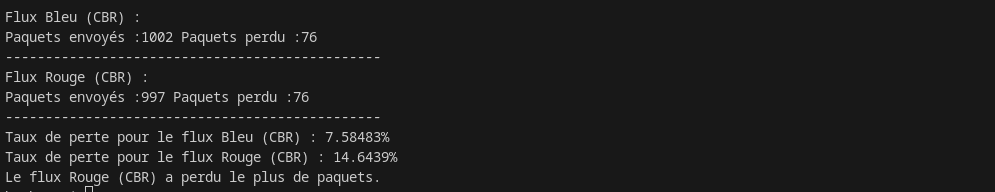
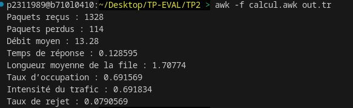
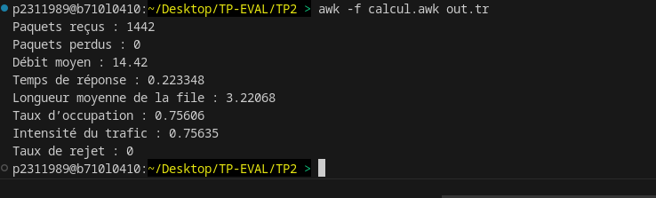
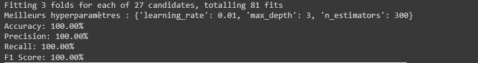

# TP 01
## Premier code

### 1- Moment d'appel de la procédure `finish`
La procédure `finish` est appelée à 5.0 secondes de temps de simulation, comme spécifié par la commande suivante dans le script :
```tcl
$ns at 5.0 "finish"
```

### Actions de la procédure `finish`

1. **Écriture des traces** :
    ```tcl
    $ns flush-trace
    ```
   Enregistre toutes les traces d'événements dans le fichier `out.nam`.

2. **Fermeture du fichier de trace** :
    ```tcl
    close $nf
    ```
   Ferme le fichier `out.nam`.

3. **Lancement de NAM** :
    ```tcl
    exec nam out.nam &
    ```
   Lance le Network Animator (NAM) pour visualiser les résultats de la simulation.

4. **Terminaison du simulateur** :
    ```tcl
    exit 0
    ```
   Termine le simulateur NS-2.

Cette procédure assure que toutes les données sont sauvegardées, que le fichier de trace est fermé, que NAM est lancé pour la visualisation, et que le simulateur se termine proprement.

### 2- Différence entre TCP et UDP

#### TCP (Transmission Control Protocol)

1. **Fiabilité** : TCP est un protocole orienté connexion qui assure la livraison fiable des paquets. Il utilise des accusés de réception (ACKs), des numéros de séquence, et des mécanismes de retransmission pour garantir que tous les paquets sont livrés dans l'ordre et sans perte.

2. **Contrôle de flux et de congestion** : TCP utilise des algorithmes de contrôle de flux et de congestion pour éviter la surcharge du réseau et s'assurer que l'émetteur ne submerge pas le récepteur avec trop de données à la fois.

3. **Connexion** : Une connexion TCP doit être établie entre l'émetteur et le récepteur avant l'échange de données (handshake en trois étapes).

4. **Utilisation typique** : Applications nécessitant une livraison fiable, comme le transfert de fichiers (FTP), le courrier électronique (SMTP), et la navigation web (HTTP).

#### UDP (User Datagram Protocol)

1. **Non-fiabilité** : UDP est un protocole sans connexion qui n'assure pas la livraison fiable des paquets. Il ne vérifie pas si les paquets sont reçus correctement ou dans l'ordre. Il ne réalise pas de retransmissions en cas de perte de paquets.

2. **Absence de contrôle de flux et de congestion** : UDP n'a pas de mécanismes de contrôle de flux ou de congestion. Les paquets sont envoyés sans vérification des capacités du réseau ou du récepteur.

3. **Sans connexion** : UDP n'établit pas de connexion avant d'envoyer des paquets. Chaque datagramme est indépendant.

4. **Utilisation typique** : Applications où la rapidité est plus importante que la fiabilité, comme la diffusion en direct (streaming), les jeux en ligne, la voix sur IP (VoIP), et les requêtes DNS.


### 3 - FTP (File Transfer Protocol) 


Un flux FTP circule sur la couche de transport et utilise TCP pour assurer la fiabilité et l'intégrité des données transférées.
### 4 - Pourquoi avant de communiquer, les agents doivent être attachés ?


Les agents doivent être attachés aux nœuds avant de communiquer pour :
- Associer les agents aux ressources réseau des nœuds.
- Permettre la gestion correcte des connexions et des échanges de paquets.
- Configurer les paramètres de communication.
- Simuler de manière réaliste le comportement des protocoles réseau.


### 5 - Quelles est la taille par défaut d’un paquet CBR ?
Taille par défaut d’un paquet CBR : 1000 octets dans NS-22 

# 2. Topologie du réseau et routage dynamique
### 1. A quoi correspondent les petits paquêts qu’on peut voir sur nam. A quels moments sont-ils échangés ?Pourquoi ?
### Analyse des paquets `rtProtoDV`

Les petits paquets `rtProtoDV`  observés dans NAM correspondent aux mises à jour des tables de routage du protocole Distance Vector (DV).

1. **Qu'est-ce que les paquets `rtProtoDV` ?**
   - Ces paquets sont des mises à jour de routage échangées entre les nœuds dans le réseau pour propager les informations de routage.
   - Chaque paquet contient des informations sur les distances (nombre de sauts) vers d'autres nœuds ue vous pouvez voir dans NAM ain saut) pour atteindre ces nœuds.

2. **À quels moments sont-ils échangés ?**
   - Ces paquets sont échangés périodiquement et lorsqu'un changement de topologie est détecté (comme la panne ou l'ajout d'un nœud ou d'un lien).
   - Dans le fichier `out.nam`, les paquets `rtProtoDV` sont échangés dès le début de la simulation pour initialiser les tables de routage, et ensuite à intervalles réguliers pour maintenir à jour les informations de routage.

3. **Pourquoi sont-ils échangés ?**
   - L'échange de ces paquets permet aux nœuds de mettre à jour leurs tables de routage de manière dynamique, en se basant sur les informations reçues de leurs voisins.
   - Ce processus assure que chaque nœud a une vue à jour de la topologie réseau et peut déterminer les meilleurs chemins pour acheminer les paquets de données.


### 2. Étude d’une propriété de k-connexité 


1. **Topologie en Grille de 9 Nœuds**
Nous avons créé une topologie en grille de 9 nœuds, numérotés de \( n(0) \) à \( n(8) \), avec les liaisons horizontales et verticales correspondantes.
<br/>

**Voici le script pour créer cette topologie** :
```tcl
#Create a simulator object
set ns [new Simulator]
#Tell the simulator to use dynamic routing
$ns rtproto DV
#Open the nam trace file
set nf [open out.nam w]
$ns namtrace-all $nf
#Define a 'finish' procedure
proc finish {} {
global ns nf
$ns flush-trace
#Close the trace file
close $nf
#Execute nam on the trace file
exec nam out.nam &
exit 0
}
#RING TOPOLOGY (Topologie Anneau)
# IMPORTANT : 1- Remarquez que les noeuds sont définis sur un tableau
# 2- ESSAYEZ DE REFAIRE LA MEME BOUCLE AVEC UN WHILE
#Create eight nodes
set i 0
while {$i < 8} {
    set n($i) [$ns node]
    incr i
}

# Créer des liens entre les nœuds avec une boucle while
set i 0
while {$i < 8} {
    $ns duplex-link $n($i) $n([expr ($i+1)%8]) 1Mb 10ms DropTail
    incr i
}
#Create a UDP agent and attach it to node n(0)
set udp0 [new Agent/UDP]
$ns attach-agent $n(0) $udp0
# Create a CBR traffic source and attach it to udp0
set cbr0 [new Application/Traffic/CBR]
$cbr0 set packetSize_ 500
$cbr0 set interval_ 0.005
$cbr0 attach-agent $udp0
#Create a Null agent (a traffic sink) and attach it to node n(3)
set null0 [new Agent/Null]
$ns attach-agent $n(3) $null0
#Connect the traffic source with the traffic sink
$ns connect $udp0 $null0
#Schedule events for the CBR agent and the network dynamics
$ns at 0.5 "$cbr0 start"
$ns rtmodel-at 1.0 down $n(1) $n(2)
$ns rtmodel-at 2.0 up $n(1) $n(2)
$ns at 4.5 "$cbr0 stop"
#Call the finish procedure after 5 seconds of simulation time
$ns at 5.0 "finish"
#Run the simulation
$ns run
```


2. **Scénario de Défaillance des Liens**

(a) **Flux constant entre \( n(3) \) et \( n(8) \)** :
Un flux constant (CBR) a été lancé entre les nœuds \( n(3) \) et \( n(8) \). en prenant un chemin de longueur 3 

( n(3) ) -> ( n(4) ) -> ( n(4) ) -> ( n(5) ) -> ( n(5) ) -> ( n(8) ) 



(b) **Défaillance des liens** :
Les liens ont été désactivés successivement toutes les 2 secondes pour forcer le flux constant à passer par le plus long chemin entre \( n(3) \) et \( n(8) \).

Liens désactivés dans l'ordre :
1. \( n(5) \) -- \( n(8) \)
2. \( n(3) \) -- \( n(6) \)
3. \( n(6) \) -- \( n(7) \)
4. \( n(3) \) -- \( n(4) \)
5. \( n(1) \) -- \( n(4) \)

**Résultats:**
L'observation dans NAM montre que le flux constant suit le chemin \( n(3) \) -> \( n(0) \) -> \( n(1) \) -> \( n(2) \) -> \( n(5) \) -> \( n(4) \) -> \( n(7) \) -> \( n(8) \), traversant 7 liens.


**Script TCL ` grid.tcl `fourni avec le rapport pour référence.**

# 3. Échanges de messages


1. **Topologie du Réseau**
La topologie du réseau est composée de trois nœuds en ligne :

```
(n0) ---- (n2) ---- (n1)
```

  - \( n0 \) et \( n2 \) sont connectés par un lien duplex de 2 Mb/s avec une latence de 5 ms.
  - \( n2 \) et \( n1 \) sont connectés par un lien duplex de 1.5 Mb/s avec une latence de 10 ms.


Les agents sont connectés, permettant l'échange de datagrammes UDP entre \( n0 \) et \( n1 \).

2. **Événements de Trace**


- **0.1s** : \( udp0 \) envoie `ping(42)` à \( udp1 \)de MSS 724 octets.
  - \( udp1 \) reçoit `ping(42)`, enregistre dans le fichier de trace et répond `pong(42)`.
- **0.2s** : \( udp1 \) envoie `countdown(5)` à \( udp0 \)de MSS 100 octets.
  - \( udp0 \) reçoit `countdown(5)`, enregistre dans le fichier de trace, décrémente le nombre et envoie `countdown(4)`.
  - Ce processus continue jusqu'à `countdown(0)`.
- **0.3s** : \( udp0 \) envoie `ignore this message please` à \( udp1 \) de MSS 500 octets.
  - \( udp1 \) reçoit le message, enregistre dans le fichier de trace, mais ne répond pas car le message ne correspond à aucune expression régulière définie.
- **0.4s** : \( udp1 \) envoie `ping(12345678)` à \( udp0 \ )de MSS 100 octets.
  - \( udp0 \) reçoit `ping(12345678)`, enregistre dans le fichier de trace et répond `pong(12345678)`.

# 4. analyse fichier trace

1. **Création des Nœuds et des Liens** :
   - Six nœuds sont créés et connectés selon la topologie spécifiée.
   - Les liens sont configurés avec un débit de 1 Mb/s et une latence de 50 ms.

2. **Positionnement des Liens pour la Visualisation** :
   - Les orientations des liens sont définies pour correspondre à la disposition visuelle des nœuds dans NAM.

3. **Création et Attachement des Agents CBR** :
   - Deux flux CBR sont configurés :
     - Un flux entre \( n0 \) et \( n4 \) avec une taille de paquet de 500 octets et un débit de 0.5 Mb/s (flux bleu).
     - Un flux entre \( n1 \) et \( n5 \) avec une taille de paquet de 500 octets et un débit de 0.5 Mb/s (flux rouge).

4. **Planification des Événements** :
   - Les flux CBR sont démarrés et arrêtés à des moments spécifiques pour éviter la congestion.
   - La simulation se termine après 10 secondes.

En exécutant ce script dans NS-2, vous devriez obtenir une visualisation NAM qui reflète la topologie donnée, avec les flux de données correctement colorés et positionnés selon les spécifications.

**Voici le résulat d'execution** :


**Nous avons utilisé ce script** :
```tcl
# Créer un objet simulateur
set ns [new Simulator]

# Définir les couleurs pour les flux de données
$ns color 0 blue
$ns color 1 red

# Ouvrir les fichiers de trace
set f [open out.tr w]
$ns trace-all $f
set nf [open out.nam w]
$ns namtrace-all $nf

# Créer les nœuds
set n0 [$ns node]
set n1 [$ns node]
set n2 [$ns node]
set n3 [$ns node]
set n4 [$ns node]
set n5 [$ns node]

# Créer les liens duplex avec 1 Mb/s de débit et 50 ms de latence
$ns duplex-link $n0 $n2 1Mb 50ms DropTail
$ns duplex-link $n1 $n2 1Mb 50ms DropTail
$ns duplex-link $n2 $n3 1Mb 50ms DropTail
$ns duplex-link $n3 $n4 1Mb 50ms DropTail
$ns duplex-link $n3 $n5 1Mb 50ms DropTail

# Positionner les liens pour la visualisation NAM
$ns duplex-link-op $n0 $n2 orient right-down
$ns duplex-link-op $n1 $n2 orient right-up
$ns duplex-link-op $n2 $n3 orient right
$ns duplex-link-op $n3 $n4 orient right-up
$ns duplex-link-op $n3 $n5 orient right-down

# Créer et attacher les agents CBR pour le flux 0-4 (bleu)
set udp0 [new Agent/UDP]
$ns attach-agent $n0 $udp0
set null0 [new Agent/Null]
$ns attach-agent $n4 $null0
$ns connect $udp0 $null0

set cbr0 [new Application/Traffic/CBR]
$cbr0 attach-agent $udp0
$cbr0 set packet_size_ 500
$cbr0 set rate_ 0.5Mb
$cbr0 set random_ false

# Créer et attacher les agents CBR pour le flux 1-5 (rouge)
set udp1 [new Agent/UDP]
$ns attach-agent $n1 $udp1
set null1 [new Agent/Null]
$ns attach-agent $n5 $null1
$ns connect $udp1 $null1

set cbr1 [new Application/Traffic/CBR]
$cbr1 attach-agent $udp1
$cbr1 set packet_size_ 500
$cbr1 set rate_ 0.5Mb
$cbr1 set random_ false

# Définir les classes pour la coloration dans NAM
$udp0 set class_ 0
$udp1 set class_ 1

# Planifier les événements de démarrage et d'arrêt des flux
$ns at 0.1 "$cbr0 start"
$ns at 0.2 "$cbr1 start"
$ns at 9.0 "$cbr0 stop"
$ns at 9.5 "$cbr1 stop"

# Planifier la fin de la simulation
$ns at 10.0 "finish"
proc finish {} {
    global ns f nf
    $ns flush-trace
    close $f
    close $nf
    puts "running nam..."
    exec nam out.nam &
    exit 0
}

# Lancer la simulation
$ns run
```

**Voici le résulat d'execution aprés avoir augementer le débit (2MB)** :


### 3- Le script pour calculer les paquets perdu pour les flux CBR :
```awk
BEGIN {
    lossBlue = 0;
    lossRed = 0;
    sentBlue = 0;
    sentRed = 0;
}

{
   
    if ($9 == 0.0 && $10 == 4.0) {
        sentBlue++;
    } else if ($9 == 1.0 && $10 == 5.0) {
        sentRed++;
    }

    if ($1 == "d") {
        if ($9 == 0.0 && $10 == 4.0) {
            lossBlue++;
        } else if ($9 == 1.0 && $10 == 5.0) {
            lossRed++;
        }
    }
}

END {
    
    print "Flux Bleu (CBR) : ";
    print "Paquets envoyés :" sentBlue " Paquets perdu :" lossBlue;
    print "-----------------------------------------------"

    print "Flux Rouge (CBR) : ";
    print "Paquets envoyés :" sentRed " Paquets perdu :" lossBlue;
    print "-----------------------------------------------"
   
    taux_perteBleu = (lossBlue / sentBlue) * 100 ;
    taux_perteRouge = (lossRed / sentRed) * 100 ;

    print "Taux de perte pour le flux Bleu (CBR) : " taux_perteBleu "%";
    print "Taux de perte pour le flux Rouge (CBR) : " taux_perteRouge "%";

   
    if (lossBlue > lossRed) {
        print "Le flux Bleu (CBR) a perdu le plus de paquets.";
    } else if (lossBlue < lossRed) {
        print "Le flux Rouge (CBR) a perdu le plus de paquets.";
    } else {
        print "Les deux flux ont perdu le même nombre de paquets.";
    }
}
```

**Le résultat d'execution** :



# TP02
## 1. L'analyse de la fonction sendpacket :
La fonction **sendpacket** dans notre simulation envoie des paquets de tailles variables à des intervalles aléatoires. Elle commence par définir et mettre à jour les variables externes nécessaires. Après un laps de temps déterminé, la fonction se rappelle pour un nouvel envoi. Ensuite, elle arrondit la taille du paquet à une valeur entière avant de l'envoyer depuis le premier nœud du réseau.
### Pour répondre a les questions suivantes nous avons coder ce simple script :
```awk
BEGIN {
    total_packets_received = 0;
    total_packets_lost = 0;
    total_queue_length = 0;
    total_response_time = 0;
    total_busy_time = 0;
    total_arrivals = 0;
    total_departures = 0;
}

{
    event = $1;
    time = $2;
    fromNode = $3;
    toNode = $4;
    packetType = $5;
    packetSize = $6;
    id = $12;
}

{
    if (event == "+") {
        enqueue[id] = time;
        enqueue2[id] = time;
        total_arrivals++;
    }
    if (event == "d") {
        total_packets_lost++;
    }
    if (event == "-") {
        dequeue[id] = time;
        total_departures++;
    }
    if (event == "r") {
        receive[id] = time;
        total_packets_received++;
    }
}

END {
    throughput = total_packets_received / 100;
    printf("Paquets reçus : %g\n", total_packets_received);
    printf("Paquets perdus : %g\n", total_packets_lost);
    printf("Débit moyen : %g\n", throughput);

    for (i = 0; i <= id; i++) {
        if (receive[i] != 0 && enqueue[i] != 0) {
            response_time = receive[i] - enqueue[i];
            total_response_time += response_time;
        }
    }
    average_response_time = total_response_time / total_packets_received;
    printf("Temps de réponse : %g\n", average_response_time);

    average_queue_length = average_response_time * throughput;
    printf("Longueur moyenne de la file : %g\n", average_queue_length);

    for (i = 0; i <= id; i++) {
        if (receive[i] != 0 && dequeue[i] != 0) {
            busy_time = receive[i] - dequeue[i];
            total_busy_time += busy_time;
        }
    }
    average_busy_time = total_busy_time / total_packets_received;
    printf("Taux d’occupation : %g\n", average_busy_time * throughput);

    for (i = 0; i < id; i++) {
        if (enqueue[i] != 0 && enqueue2[i] != 0) {
            inter_arrival_time = enqueue[i+1] - enqueue2[i];
            total_inter_arrival_time += inter_arrival_time;
        }
    }
    average_inter_arrival_time = total_inter_arrival_time / total_packets_received;
    traffic_intensity = average_busy_time / average_inter_arrival_time;
    printf("Intensité du trafic : %g\n", traffic_intensity);

    packet_loss_rate = total_packets_lost / (total_packets_lost + total_packets_received);
    printf("Taux de rejet : %g\n", packet_loss_rate);
}

```

### 2. Débit Moyen : 
- Le débit est le nombre de paquets reçus divisé par le temps de simulation.
- Débit moyen = **13.2954** paquets/seconds
### 3. Le temps de Réponse : 
- Le temps de réponse est l'intervalle entre le temps de la réception du paquet et le temps de l'arrivé dans la file d'attente
- Le temps de réponse : **0.128595** s
### 4. La longueur moyenne de la file :
- C'est le débit multiplié par le temps de réponse
- La longueur moyenne : **1.70972**
### 5. Le taux d'occupation :
- C'est la multiplication du débit par le temps de service moyen
- Le taux d'occupation : **0.691569** <==> **69%**
### 6. L'intensité du Traic :
- C'est le temps de service divisé par le temps entre 2 arrivées
- L'intensité du trafic : **0.691834**
### 7. Le taux de rejet : 
- C'est le nombre de paquets perdus / le nombre du paquets total (reçu + perdu)
- Le taux de rejet : 0.0790569

### Capture d'écran d'execution


## Les calculs pour M/M/1/infinie

### 2. Débit Moyen : 
- Débit moyen = **14.42** paquets/seconds
### 3. Le temps de Réponse : 
- Le temps de réponse : **0.0.223348** s
### 4. La longueur moyenne de la file :
- La longueur moyenne : **3.22068**
### 5. Le taux d'occupation :
- Le taux d'occupation : **0.75606** <==> **75%**
### 6. L'intensité du Traic :
- L'intensité du trafic : **0.75635**
### 7. Le taux de rejet : 
- Le taux de rejet : **0.0790569**

### Capture d'écran d'execution


# TP03

## Description Générale du Code
Le code dans le notebook fourni effectue les étapes suivantes :

### 1 Importation des bibliothèques nécessaires :

- Charge les bibliothèques pour la manipulation des données (pandas), la modélisation (xgboost), l'évaluation (sklearn.metrics), et la visualisation (matplotlib, seaborn).


### 2 Chargement et Préparation des Données :

- Charge les données de suivi de paquets à partir d'un fichier CSV.

- Filtre et transforme les données pour obtenir un jeu de données utilisable pour la modélisation. Cela inclut la suppression des événements inutiles et la création de nouvelles colonnes (time_x, time_y, size, event).

### 3 Division des Données :

- Sépare les données en ensembles d'entraînement et de test.
- Définit les caractéristiques (features) et la variable cible pour l'entraînement du modèle.

### 4 Entraînement du Modèle XGBoost :

- Initialise et entraîne un modèle de régression XGBoost sur les données d'entraînement.
- Utilise la validation croisée pour ajuster le modèle et éviter le surapprentissage.

### 5 Évaluation de l'Importance des Caractéristiques :

- Calcule et affiche l'importance des caractéristiques utilisées par le modèle pour effectuer ses prédictions.

### 6 Prédiction et Visualisation :

- Utilise le modèle entraîné pour prédire les valeurs de la variable cible sur l'ensemble de test.
- Compare les prédictions aux valeurs réelles et affiche les résultats sous forme de graphique.

### 7 Calcul de la Précision :

- Calcule et affiche la précision du modèle en arrondissant les prédictions pour obtenir des valeurs binaires (0 ou 1).

## pourquoi le résultat arrivant à 85% de précision est en vrai très mauvais

### 1 Déséquilibre des Classes :

Lorsque les données sont fortement déséquilibrées, avec une majorité de paquets reçus correctement et une minorité de paquets perdus, un modèle peut facilement atteindre une précision élevée en prédisant simplement la classe majoritaire. Par exemple, si 85% des paquets sont reçus correctement, un modèle qui prédit toujours "paquet reçu" atteindra une précision de 85%. Cependant, cela ne signifie pas que le modèle est efficace pour détecter les pertes de paquets.

### 2 Surapprentissage (Overfitting) :

Le modèle peut sembler performant sur les données de test parce qu'il a mémorisé les spécificités de ces données, plutôt que d'apprendre des tendances générales. Cela signifie qu'il ne se généralisera pas bien à de nouvelles données. Un bon modèle doit capturer des tendances générales et être capable de faire des prédictions précises sur des données qu'il n'a jamais vues auparavant.

### 3 Erreur de Mesure :

La précision est une mesure simpliste qui ne prend pas en compte les faux positifs et les faux négatifs. Dans des situations où les coûts des erreurs sont différents (par exemple, lorsque manquer une perte de paquet est plus coûteux que prédire une perte incorrecte), des métriques comme la précision (precision), le rappel (recall) et le F1-score sont plus appropriées. Ces métriques offrent une vue plus complète de la performance du modèle en équilibrant les différents types d'erreurs.

## Le bonus

**Voici une version améliore du code:**

```py
# Importation des bibliothèques nécessaires
import pandas as pd
import xgboost as xgb
from sklearn.model_selection import train_test_split, GridSearchCV
from sklearn.metrics import accuracy_score, precision_score, recall_score, f1_score
import matplotlib.pyplot as plt
import seaborn as sns
color_pal = sns.color_palette()
plt.style.use('fivethirtyeight')

# Chargement des données
cols = ["event", "time", "size", "id"]
df = pd.read_csv('log_ns2.csv', header=None, sep=';', names=cols)
df = df[df["event"] != '-']  # Supprimer les sorties de file

# Séparer les données d'arrivée et de résultat
df_Arr = df[df["event"] == '+'].drop("event", axis=1)
df_Res = df[df["event"] != '+'].drop("size", axis=1)

# Fusionner les jeux de données
dataset = pd.merge(df_Arr, df_Res, on="id").drop("id", axis=1)
dataset = dataset.replace({'r': 1, 'd': 0})

# Ajout de nouvelles caractéristiques
dataset['latency'] = dataset['time_y'] - dataset['time_x']
dataset['previous_time'] = dataset['time_x'].shift(1)
dataset['time_diff'] = dataset['time_x'] - dataset['previous_time']
dataset = dataset.fillna(0)  # Remplacer les NaN par 0

# Séparation des données en ensembles d'entraînement et de test
train = dataset[dataset.index < 1500]
test = dataset[dataset.index >= 1500]

FEATURES = ['time_x', 'time_y', 'size', 'latency', 'time_diff']
TARGET = 'event'

X_train = train[FEATURES]
y_train = train[TARGET]

X_test = test[FEATURES]
y_test = test[TARGET]

# Entraînement du modèle XGBoost avec optimisation des hyperparamètres
param_grid = {
    'n_estimators': [100, 300, 500],
    'max_depth': [3, 5, 7],
    'learning_rate': [0.01, 0.1, 0.2]
}

grid_search = GridSearchCV(estimator=xgb.XGBClassifier(), param_grid=param_grid, scoring='accuracy', cv=3, verbose=1)
grid_search.fit(X_train, y_train)

# Meilleurs hyperparamètres
best_params = grid_search.best_params_
print("Meilleurs hyperparamètres :", best_params)

# Entraînement du modèle avec les meilleurs hyperparamètres
model = xgb.XGBClassifier(**best_params)
model.fit(X_train, y_train)

# Prédictions
y_pred = model.predict(X_test)

# Évaluation du modèle
accuracy = accuracy_score(y_test, y_pred)
precision = precision_score(y_test, y_pred)
recall = recall_score(y_test, y_pred)
f1 = f1_score(y_test, y_pred)

print(f"Accuracy: {accuracy * 100:.2f}%")
print(f"Precision: {precision * 100:.2f}%")
print(f"Recall: {recall * 100:.2f}%")
print(f"F1 Score: {f1 * 100:.2f}%")

# Importance des caractéristiques
fi = pd.DataFrame(data=model.feature_importances_, index=FEATURES, columns=['importance'])
fi.sort_values('importance').plot(kind='barh', title='Importance des caractéristiques')
plt.show()
```
**Les résultats sont :**


### Explications des Améliorations
**1 Ajout de nouvelles caractéristiques :**

- **latency** : temps entre l'envoi et la réception, pour capturer les délais.
- **time_diff** : temps depuis le dernier paquet, pour capturer les intervalles entre les paquets.


**2 Optimisation des hyperparamètres :**

- Utilisation de GridSearchCV pour trouver les meilleurs paramètres du modèle.

**Utilisation de métriques d'évaluation avancées :**

- Calcul de la précision, du rappel et du F1-score en plus de la précision pour mieux évaluer la performance du modèle.

Ces améliorations devraient aider à obtenir un modèle plus robuste et capable de mieux généraliser aux nouvelles données, tout en fournissant une évaluation plus complète de sa performance.


